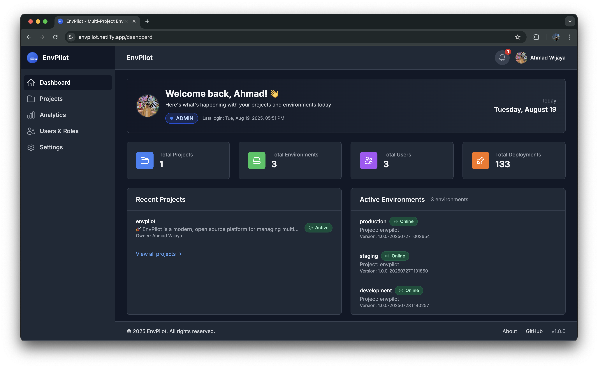

# EnvPilot

EnvPilot is a modern, open source platform for managing multi-environment deployments, analytics, and team collaboration. It provides a unified dashboard for projects, environments, deployments, notifications, and user management, with seamless Jenkins integration and advanced analytics.

## Preview



## Features

- Multi-environment deployment management (development, staging, production)
- Centralized environment and project configuration
- Jenkins CI/CD integration
- Real-time build logs and notifications
- Role-based access control (Admin, Developer, QA, User)
- User and project assignment
- System monitoring and analytics dashboard
- Feature flags and system settings
- Modern, responsive UI (React + Tailwind CSS)
- RESTful backend (Spring Boot)

## Getting Started

### Prerequisites

- Node.js (v16+)
- npm or yarn
- Java 17+
- Maven
- Jenkins (for CI/CD integration)
- PostgreSQL (default, can be changed)

Alternatively, use [Docker](#running-with-docker) and only Docker/Docker Compose are required.

### Installation

#### 1. Clone the repository

```bash
git clone https://github.com/[your-username]/envpilot.git
cd envpilot
```

#### 2. Backend Setup

```bash
cd backend
cp src/main/resources/application.yml.example src/main/resources/application.yml
# Edit application.yml as needed (DB, Jenkins, etc)
mvn clean install
mvn spring-boot:run
```

#### 3. Frontend Setup

```bash
cd ../frontend
npm install
npm start
```

#### 4. Access the App

- Frontend: http://localhost:3000
- Backend API: http://localhost:9095

### Running with Docker

The whole stack (frontend, backend, PostgreSQL, and a dev-mode Vault instance for secrets) can be run with Docker Compose — no local Node/Java/Maven/Postgres install required.

```bash
cp .env.docker.example .env
# Edit .env: set EMAIL_USERNAME/EMAIL_PASSWORD (Gmail app password) if you need
# outgoing email, and change JWT_SECRET/VAULT_TOKEN for anything beyond local dev.

docker compose up -d --build
```

This builds and starts:

- `postgres` — application database
- `vault` — Vault dev server (the backend reads DB/JWT/email credentials from it, matching how `application.yml` is configured in production)
- `vault-init` — one-shot container that seeds the secrets above into Vault, then exits
- `backend` — Spring Boot API on http://localhost:9095
- `frontend` — React app served via nginx on http://localhost:3000

Check status with `docker compose ps` and logs with `docker compose logs -f backend`. Stop everything with `docker compose down` (add `-v` to also drop the Postgres volume).

#### Development mode (hot reload)

For local development with live code reload, layer `docker-compose.dev.yml` on top of the base file:

```bash
docker compose -f docker-compose.yml -f docker-compose.dev.yml up --build
```

This keeps `postgres`/`vault`/`vault-init` as-is, but runs `backend` and `frontend` from dev images instead:

- `backend` — runs `mvn spring-boot:run` against the bind-mounted `./backend`, restarting automatically whenever a source file changes
- `frontend` — runs the CRA dev server (`npm start`) against the bind-mounted `./frontend` on http://localhost:3000, with webpack hot reload

Edit files under `backend/src` or `frontend/src` on your host and the running containers will pick up the changes.

## Usage

- Log in as admin (default: admin@envpilot.com / admin123)
- Create and manage projects, environments, and users
- Configure Jenkins for CI/CD
- Monitor deployments and system health
- Assign users to projects and environments

## Contributing

Contributions are welcome! Please follow these steps:

1. Fork the repository
2. Create a new branch (`git checkout -b feature/your-feature`)
3. Commit your changes (`git commit -am 'Add new feature'`)
4. Push to your fork (`git push origin feature/your-feature`)
5. Open a Pull Request

Please read [CONTRIBUTING.md](CONTRIBUTING.md) for more details.

## License

This project is licensed under the MIT License. See [LICENSE](LICENSE) for details.
